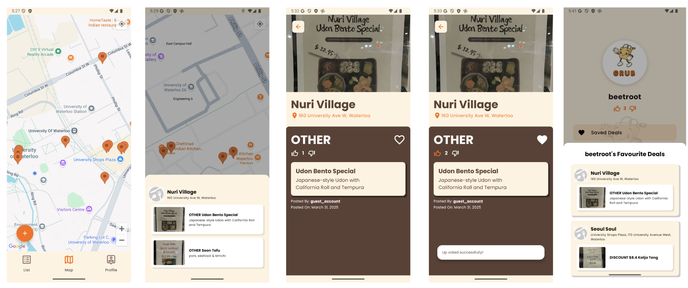
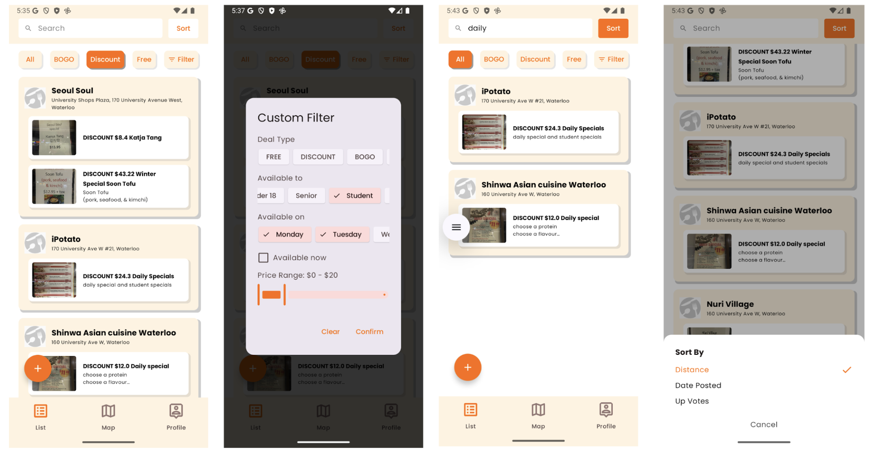
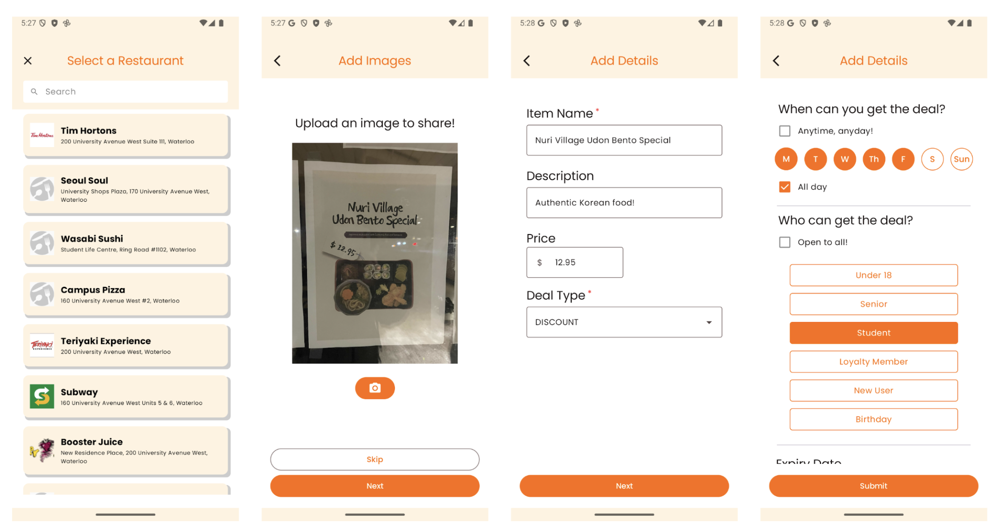

### CS 446 course project

Grub is a community-driven Android app for discovering and sharing local restaurant deals. With features like map-based deal browsing, upvoting, saving, and filtering, Grub makes finding affordable deals more accessible. Users can easily add deals, upload photos, and engage with a tight-knit group of food lovers, bringing exposure to local restaurants and kindling a sense of excitement around our shared love for food. Whether you’re a student, family, or foodie, Grub connects you to the best dining discounts on the go and wants you to share what you think.

